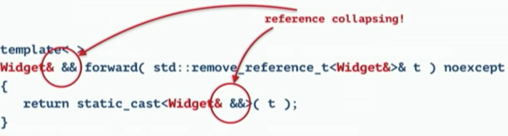
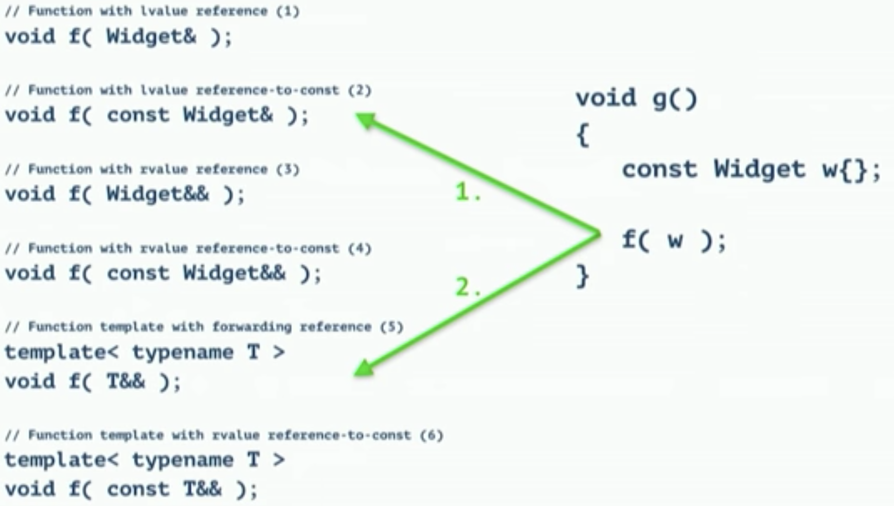

# Move Semantics

## The Basic of Move semantics
  * Overview of this section

    

  * `lvalue` assignment
    * `v2=v1` is an `lvalue` assignment. 
    * It creates another memory of vector in heap and copy all heap values from v1 into this new one. 
    * Another stack `v2` will be created and point to the begin and the end of the new heap memory chunk.
    * Prior to `C++11`, `v2=createVector()` is an `lvalue` assignment.
    * See image below

      

  * `rvalue` assignment
    * By calling `v2=std::move(v1)`, what `v1` points to will be transfered to `v2` and `v1` in stack will become `null`. See image below.

      

    * For `v2=createVector()` after `C++11`, a `__tmp__` memory will be created in stack. Then `std::move(__tmp__)` will be applied to move what `__tmp__` points to to `v2`.
    * `std::move` unconditionally casts its input into an rvalue reference and does not move anything. rvalue references represent modifiable objects that are no longer needed. See image below.

      

## The New Special Member Functions

  * Overview of this section

    

  * Please keep in mind: **Rule of Zero: If you can avoid defining default operators, do!** Altough we are going to break this in the following sub sections.

### The Move Constructor

  * Overview of this section

    

  * Several key points
    * If we make string initialized as `s(w.s)`, this will be a copy instead of a move.
    * **Make move operations noexcept** Experiment shows that the performance will be improved by 60% by doing do.
    * **A move operation should move and leave its source in a valid state.** Ideally, that moved-from should be the default value of the type. Ensure that unless there is an exceptionally good reason not to. This is the reason why we need to reset `w.pi = nullptr`.
    * By changing `w.pi`'s type from a raw pointer to `unique_ptr<int> pi`, the construtor will be identical to default move operator.

### The Move Assignment Operator

  * Overview of this section

    

  * **If you define or =delete any default operation, define or delete them all.** Follow "Rule of Five" or "Rule of Six" 

## Parameter Conventions

  * **Prefer simple and conventional ways of passing information.**
  * Overview table of ways to passing information into functions.

    

## Forward References

  * Forwarding references represent
    * an `lvalue` reference if they are initialized by an `lvalue`
    * an `rvalue` reference if they are initialized by an `rvalue`
  
  * `Rvalue` references are forwarding references if they
    * involve type deduction
    * appear in exactly the form `T&&` or `auto&&`

  * For example

    

  * Reference collapsing: It is permitted to form references to references through type manipulations in templates or typedefs, in which case the reference collapsing rules apply. Please refer to the following image for Reference collapsing rules.

    

    * In general, **`rvalue` reference to `rvalue` reference collapses to `rvalue` reference, all other combinations form `lvalue` reference**.

### Perfect Forwarding

  * Definition: Forward arguments of one function to another as though the wrapped function had been called directly. 
  * Solution: Pass-by-Forward referencing. An example of perfect forwarding by implementing `make_unique`. 

    

  * `std::forward`: **conditionally** casts its input into an rvalue reference

    

    * If the given value is a `lvalue` (in the case below `Widget &` type), cast it to an `lvalue` reference. 

      
      

    * If the given value is a `rvalue` (in the case below `Widget` type), cast it to an `rvalue` reference.

      

    * Double forward on the same function parameter is not allowed. Please see the example below. We need to copy `t` first into `b_` before we forward it to `c_`.

      

### Overloading with Forwarding References

  * Overall rule: **Aviod Overloading on Universal references.**
  * Several examples of what function will be chosen when overloading.

    
    
    
    