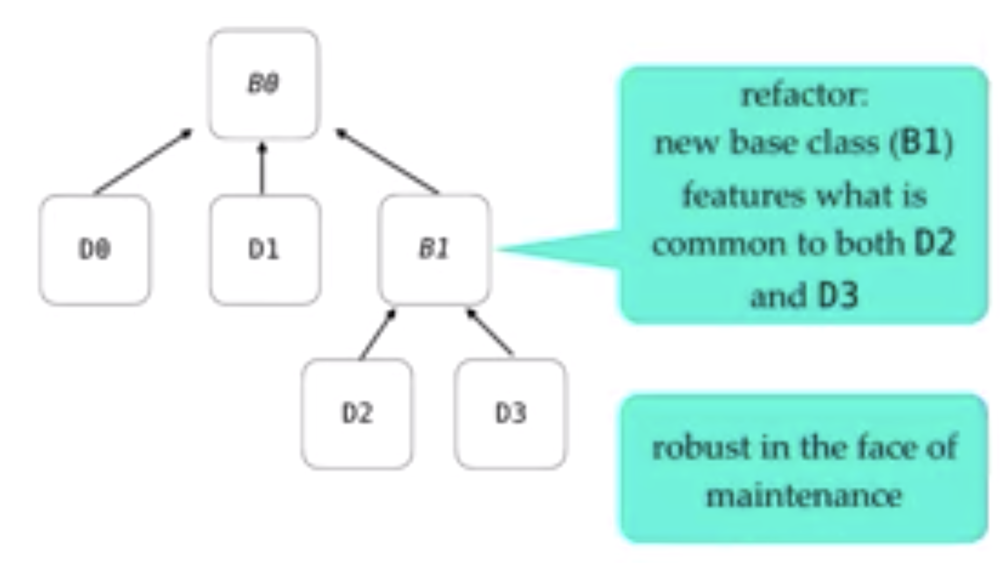

# Best Practices for Objective Oriented Programming in C++

## Theory of OOP

  * **Definition**: Using polymorphism based runtime function dispatch using virtual functions;
  * Derived objects in OOP considered as independent libraries;
  * Example logging
    * **Base class**: defines library interface;
    * **Derived class**: provide one library implementation;

    ```
    // Base class
    struct Logger {
      virtual void LogMessage(char const* msg) = 0;
      virtual ~Logger() = default;
    };

    // Derived class
    struct ConsoleLogger : final Logger {
      void LogMessage(char const* msg) override {
        std::cout << msg << "\n";
      }
    };
    ```
  * Liscov Substitution
    * **Subtype Requirement**: Code behaved correctly for API defined by Type B object also work correctly for Type D object, D is a subtype of B.
    * **Liscov Substitution**: Each derived type is a logical subtype of base class type, providing intended semantics of the defined interface.
    * **Key Overriding Practices**: An override can ask for less and provide more, but can never require more or promise less.

## Design Guidelines
  ### Use OOP to model "is-a" relationships, not for code-reuse
  * Inheritance: Powerful hierarchies are built on well-defined abstractions.

  ### Make non-leaf class abstract
  * **Object Slicing in C++**: A derived class object can be assigned to a base class object, but the other way is not possible. Object slicing happens when a derived class object is assigned to a base class object, additional attributes of a derived class object are sliced off to form the base class object.
  * Example of object slicing
  ```
  class Base { int x, y; }; 
    
  class Derived : public Base { int z, w; }; 
    
  int main()  
  { 
      Derived d; 
      Base b = d; // Object Slicing,  z and w of d are sliced off 
  }
  ```
  * Rule of thumb: **Only dereferencing an OOP pointer/ref to access base class members.**
  * Example of best practice: 
    * Original design

      

    * Improved Design

      
  
  * Scott Myers steps:
    * Step 1: Make each class in the hierarchy either a base-only or a leaf-only
    * Step 2: Make bases abstract (via pure virtual functions) and protected assignment operators
    * Step 3: Make leaf classes concrete, public assignment operators and **final**
  

## Building (code-level) Guidelines